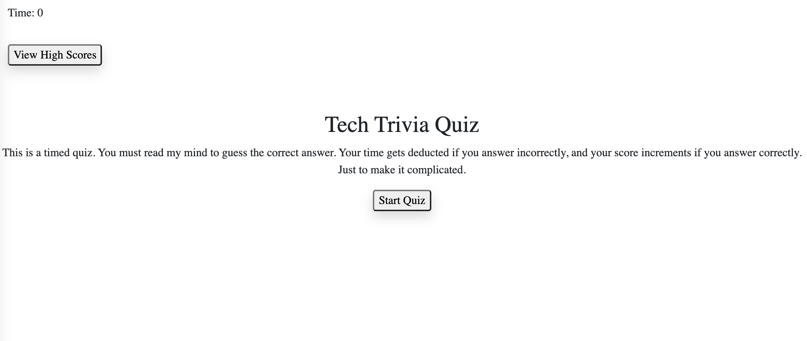

# Tech-Trivia-Quiz
Challenges users with both obvious and random tech trivia questions made with Vanilla JS, HTML, CSS, Google Fonts, and Bootstrap.

# Table of Contents
* [Project Description](#desc)
* [How I Made It](#process)
* [Usage](#usage)
* [URL](#URL)

<a name= "desc"></a>
## 03 Code (Tech Trivia) Quiz

To help you become familiar with these tests and give you a chance to apply the skills from this module, this week’s Challenge invites you to build a timed coding quiz with multiple-choice questions. This app will run in the browser, and will feature dynamically updated HTML and CSS powered by JavaScript code that you write. It will have a clean, polished, and responsive user interface. This week’s coursework will teach you all the skills you need to succeed in this assignment.


<a name="process"> </a>
## How I Made It

I first pseudocoded the quiz to break down all the different functions and elements into a few moving parts. I created global variables such as time, score, and questionIndex and I also referenced DOM elements at the top of the JS; some of these are interchangeably hidden and seen depending on the function. I also made a questions object which would be looped through using the index and the loadQuestions function. The user presses the start button to start the timer and load the questions. Each click on an answer starts a function to check to see if it is correct, and based on that either subtracts time or increments the score and moves onto the next question depending on the index as compared to the questions object length and the time left. the score is then collected and displayed for the user at the end of the quiz and the timer is stopped. The page prompts them to submit a 3-letter initial to save with their score and gives alerts if the input does not fit the criteria. Their score is saved into local storage and printed onto the high scores page by dynamically adding and setting attributes to list elements as scores are input. This page can be accessed via the view highscores button at any time during the quiz. The user has the opportunity to clear the page and local storage before restarting the quiz. I played around with bootstrap styling, google fonts, and CSS to add more functionality and personality to the quiz according to my current level of knowledge and ease with these tools. 

In sum, this app operates using 7 functions: startQuiz, loadQuestions, checkAnswers, endQuiz, sendscores, showScores, and clearScores.

This is how the homepage looks:


<a name= "usage"></a>
## Acceptance Criteria

```
GIVEN I am taking a code quiz
WHEN I click the start button
THEN a timer starts and I am presented with a question
WHEN I answer a question
THEN I am presented with another question
WHEN I answer a question incorrectly
THEN time is subtracted from the clock
WHEN all questions are answered or the timer reaches 0
THEN the game is over
WHEN the game is over
THEN I can save my initials and score

```
<a name= "URL"></a>
## URL

Deployed App: https://rheam97.github.io/Code-quiz/

Repo: https://github.com/rheam97/Code-quiz.git